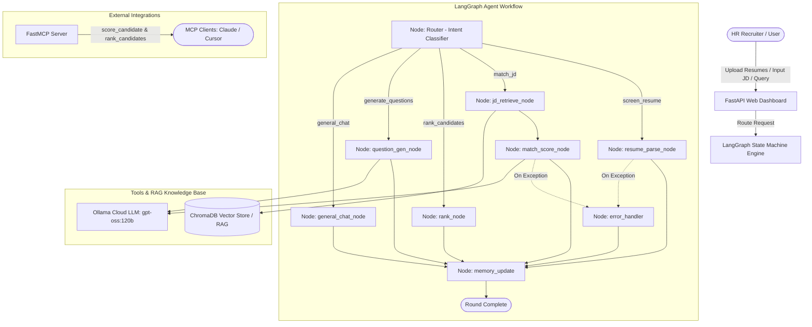

# AI HR Recruitment Assistant ⚡

> **Final Project — TNSDC Virtual Internship Program (IBM Agentic AI Track)**  
> An autonomous Agentic AI application for candidate screening, semantic job description matching, candidate ranking, and tailored interview question generation.

---

## 🌟 Key Capabilities

1. **Intelligent Resume Screening**: Ingests multiple candidate resumes (`PDF`, `DOCX`, and `TXT`) and extracts normalized structured candidate records (skills, years of experience, past roles, education, and certifications).
2. **Semantic JD Matching (RAG-Grounded)**: Automatically chunks and indexes Job Descriptions into a vector knowledge base (ChromaDB), retrieving grounding context to evaluate strengths, gaps, and compute an objective 0–100 match score.
3. **Candidate Ranking & Shortlisting**: Dynamically ranks candidates into an executive shortlist sorted by fit level with statistical percentiles.
4. **Targeted Interview Question Generation**: Generates 5 tailored interview questions per candidate:
   - 2 Role-Fit & Architecture questions
   - 2 Deep-dive **Gap-Probing** questions (specifically testing identified skill shortages)
   - 1 Scenario-based behavioral question, accompanied by an **Interviewer Rubric ("What to listen for")**.
5. **Conversational Agent Dialogue**: Powered by a multi-node **LangGraph state machine** that maintains round memory and answers recruiter inquiries.
6. **Model Context Protocol (MCP)**: Exposes recruitment tools (`score_candidate`, `rank_candidates`, `generate_interview_questions`) over standard MCP for integration with Claude Desktop, Cursor, or external MCP clients.
7. **FastAPI Modern Web Dashboard**: A responsive, dark-mode glassmorphic interface with drag-and-drop bulk upload, real-time leaderboard, candidate detail drawer, and CSV shortlist export.

---

## 🏗️ System Architecture



---

## 📂 Repository Structure

```
IBM_HR_assistant/
├── .env                        # Local API secrets (OLLAMA_API_KEY) — Git-ignored
├── .env.example                # Safe environment template
├── .gitignore                  # Excludes .env, uploaded files, and vector databases
├── config.py                   # Centralized application settings & Ollama client
├── requirements.txt            # Python dependencies
├── README.md                   # Project documentation
├── main.py                     # FastAPI application & glassmorphic dashboard
│
├── agent/
│   ├── __init__.py
│   ├── graph.py                # LangGraph StateGraph state machine
│   ├── nodes.py                # Graph node implementations with error handling
│   ├── router.py               # Intent classifier router
│   └── state.py                # HRState TypedDict schema
│
├── tools/
│   ├── __init__.py
│   ├── resume_parser.py        # PDF/DOCX extractor & LLM JSON normalizer
│   ├── jd_retriever.py         # Vector search over Job Descriptions
│   ├── scorer.py               # Candidate scoring & strengths/gaps evaluator
│   ├── ranker.py               # Shortlist sorting & percentile ranking
│   └── question_gen.py         # Tailored role-fit & gap-probing question generator
│
├── rag/
│   ├── __init__.py
│   ├── ingestor.py             # RecursiveCharacterTextSplitter & ChromaDB indexing
│   └── retriever.py            # Top-k semantic retrieval wrapper
│
├── memory/
│   ├── __init__.py
│   └── session.py              # SQLite-persisted session state across turns
│
├── mcp/
│   ├── __init__.py
│   └── server.py               # Model Context Protocol (MCP) server
│
├── ui/
│   ├── __init__.py
│   └── export.py               # CSV shortlist generation
│
├── sample_data/
│   ├── sample_jd.txt           # Sample Senior Backend AI Engineer JD
│   ├── generate_samples.py     # Script that builds sample resumes
│   ├── alex_morgan_resume.pdf  # Sample Senior AI Engineer (High Match)
│   ├── priya_sharma_resume.docx# Sample Backend Developer (Moderate Match)
│   └── marcus_vance_resume.pdf # Sample Junior Frontend (Low Match)
│
└── tests/
    ├── __init__.py
    ├── test_agent_graph.py     # LangGraph workflow unit tests
    ├── test_resume_parser.py   # PDF/DOCX parsing tests
    ├── test_scorer.py          # Candidate scoring tests
    ├── test_ranker.py          # Candidate ranking tests
    ├── test_question_gen.py    # Interview question generation tests
    ├── test_rag_retriever.py   # RAG vector store tests
    └── test_live_api.py        # Full end-to-end integration test
```

---

## 🚀 Getting Started

### 1. Prerequisites
- Python 3.10+ (Tested on Python 3.13)
- An Ollama Cloud API Key (or local Ollama instance)

### 2. Installation
Clone the repository and install the dependencies:
```bash
git clone https://github.com/your-username/IBM_HR_assistant.git
cd IBM_HR_assistant
pip install -r requirements.txt
```

### 3. Environment Configuration
Copy `.env.example` to `.env`:
```bash
cp .env.example .env
```
Edit `.env` with your Ollama Cloud credentials:
```env
OLLAMA_API_KEY=your_ollama_cloud_api_key_here
OLLAMA_BASE_URL=https://api.ollama.com
OLLAMA_MODEL=gpt-oss:120b
```
*(Note: `.env` is already configured in `.gitignore` to prevent leaking keys.)*

### 4. Generate Sample Resumes (Optional)
```bash
python sample_data/generate_samples.py
```

### 5. Run the Application
Start the FastAPI server:
```bash
python main.py
```
Open your browser and navigate to:
```
http://127.0.0.1:8000
```

---

## 🧪 Running Unit & Integration Tests

Execute the comprehensive unit test suite:
```bash
pytest tests/ -v
```

Run the live end-to-end API test:
```bash
python tests/test_live_api.py
```

---

## 🔌 Model Context Protocol (MCP) Integration

This application includes a native MCP server exposing the recruitment evaluation tools to any MCP-compliant client.

To run the MCP server:
```bash
python mcp/server.py
```

**Exposed MCP Tools:**
- `mcp_score_candidate(candidate_name, skills_csv, years_of_experience, jd_text)`
- `mcp_rank_candidates(scored_candidates_json)`
- `mcp_generate_interview_questions(candidate_name, role, skill_gaps_csv)`

### Connecting to Claude Desktop / Cursor
Add the following to your `claude_desktop_config.json`:
```json
{
  "mcpServers": {
    "hr-recruitment-assistant": {
      "command": "python",
      "args": ["d:/project works/IBM_HR_assistant/mcp/server.py"],
      "env": {
        "OLLAMA_API_KEY": "your_ollama_cloud_api_key_here"
      }
    }
  }
}
```

---

## 🎬 Demo Walkthrough (5-Minute Presentation Guide)

1. **Job Description Ingestion**:
   - Navigate to the **📝 Job Description (RAG)** tab.
   - Click **"Pre-fill Sample Senior AI Engineer JD"** or paste your own JD.
   - Click **"Save & Ingest into RAG Vector Store"**. Notice the chunk count confirmation.
2. **Bulk Resume Screening**:
   - Switch to the **📁 Resumes & Screening** tab.
   - Click **"Load 3 Built-in Sample Candidates"** (or upload your own PDF/DOCX files).
   - View the parsed candidate cards showing normalized skills and years of experience.
3. **Multi-Candidate Evaluation & Leaderboard**:
   - Go to the **📊 Ranking & Shortlist** tab.
   - Click **"🚀 Run Evaluation & Ranking"**.
   - Review the ranked table:
     - **#1 Alex Morgan** (~85/100, Strong Match — Advance to Technical Interview)
     - **#2 Priya Sharma** (~68/100, Moderate Match — Consider for Phone Screening)
     - **#3 Marcus Vance** (~20/100, Not Qualified — Do Not Advance)
4. **Candidate Deep-Dive & Interview Guide**:
   - Click **"📋 Deep-Dive & Questions"** for Alex Morgan or Priya Sharma.
   - Observe the breakdown of strengths, identified gaps, and grounded reasoning.
   - Review the tailored interview questions containing both role-fit questions and **targeted gap-probing questions** with interviewer rubrics.
5. **Shortlist Export**:
   - Click **"📥 Export Shortlist CSV"** to download the structured spreadsheet.
6. **Agent Dialogue**:
   - Switch to the **💬 Agent Dialogue** tab.
   - Ask: *"Who is the best candidate for LangGraph and RAG?"* or *"Rank everyone so far"*.

---

## 🔒 Candidate Data Privacy & Compliance Notice

> **IMPORTANT:** This project is built as a demonstrative prototype for the TNSDC Virtual Internship Program. Resumes contain sensitive personally identifiable information (PII). In this application:
> - Uploaded files are processed in a transient temporary directory and deleted immediately upon normalization.
> - Vector embeddings and session databases remain local to the runtime host (`chroma_db/`, `sessions.db`).
> - Prior to production enterprise deployment, a comprehensive data protection impact assessment (DPIA), GDPR/CCPA compliance review, data retention policy, and algorithmic bias audit must be conducted.

---

## 🔮 Known Limitations & Future Improvements

- **Async Batching**: Expand parallel scoring for high-volume recruitment drives (>50 resumes simultaneously).
- **Automated Scheduling**: Integrate calendar APIs (Google Calendar / Outlook) to schedule interviews directly from shortlisted profiles.
- **Fairness & Bias Auditing**: Implement automated de-biasing filters to anonymize names, gender markers, and institutions before scoring.
- **Multimodal Resume Parsing**: Add OCR integration (e.g. Tesseract / PyMuPDF OCR) for scanned image resumes.
